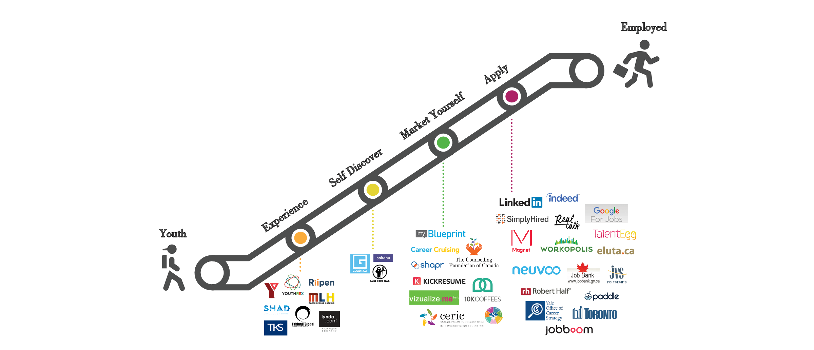
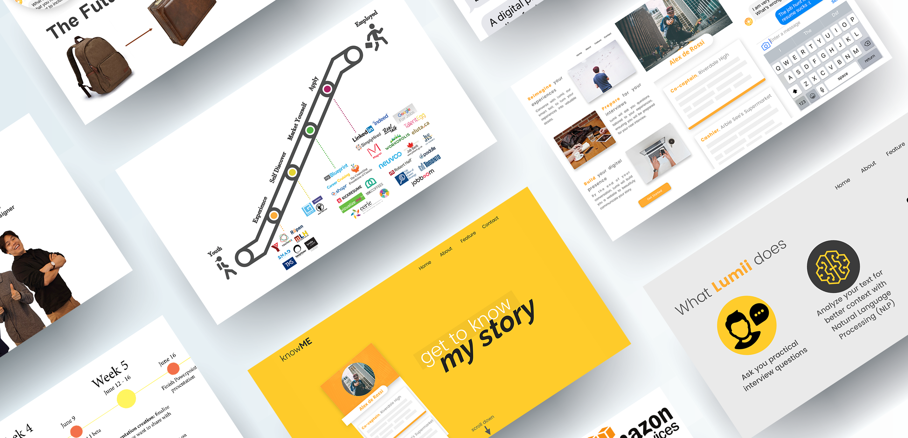

> We were tasked to develop a technology-based solution that helps prepare youth for the future of work.

Under the RBC's Corporate Citizenship, Future Launch represents RBC’s largest ever commitment to a social issue. With the funding of half a billion dollars, the goal is to help Canadian youth aged 15-29 struggling for opportunities to find employment and elevate the Canadian economy.

> Meet Lumii: The personal career agent for young Canadians aged 15-29

<video width="100%" controls loop>
<source src="/lumiivid1.mp4" type="video/mp4">
</video>

> The Chatbot that works to close the gap between you and your future job.

<video width="100%" controls loop>
<source src="/lumiivid4.mp4" type="video/mp4">
</video>

As the UI/UX Design and Research Lead, I was tasked with designing the co-design sessions for gathering user experience data about young people's struggles and major pain points in seeking employment. We conducted semi-structured interviews with young people and followed with a collaborate co-design session that aimed to extrat the user's stories.

We created personas and tested out assumptions that validated Lack of Experience and Uncertainty as main culprits for pain points. We matched these primary data sets with secondary research by investigating the current products and services that help the youth find employment through a Competitive Analysis (also known as environmental scans, horizon scans or market intelligence).

> Young people are worried about their lack of experience & uncertainty about finding the "right" job

Based on our reserach, I divided the job seeking process by stages Experience, Self-Discover, Market Yourself and Apply. By scanning the existing solutions out there we were able to find that there was an area in the user's journey that needed improvement: Self-Discover. Thus Lumii was designed to help youth self-discover their past experiences and help market them for a successful future.

> "Find a democratic solution that gives equal access and opportunity."

This was the answer to my question "So am I allowed to care about the minority representation?". This served as the foundation in which our project would be built on. We had 4 months to research, ideate, prototype, iterate and pitch our solution to key executive stakeholders of the organization.

 

   
###
Tools Used

 

</img>
    

     Sketch
    

</img>
    

     Node.js
    

</img>
    

     Docker
    

</img>
    

     Swift
    

</img>
    

     Amazon Web Services
    

